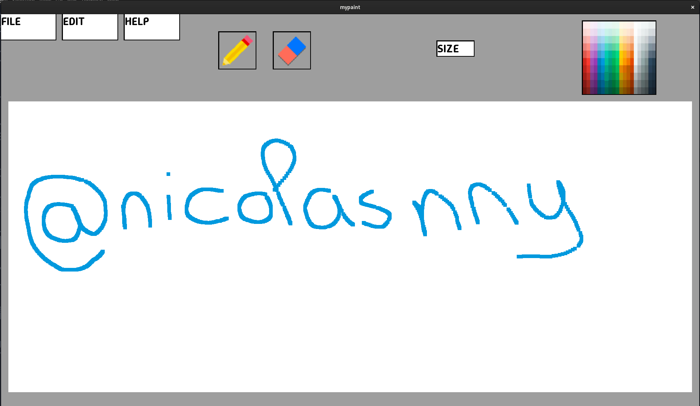

# My Paint - 3 weeks

My paint is a reproduction of a paint type software unsing CSFML library

## Compilation
```
make
```

## Usage
To launch my_paint, follow this step:

   ```
   ./my_paint
   ```

## Functionnalities
- draw
- erase
- change pencil and brush size (small, medium, large)
- change pencil color using a color palette
- create a new file
- save a file


